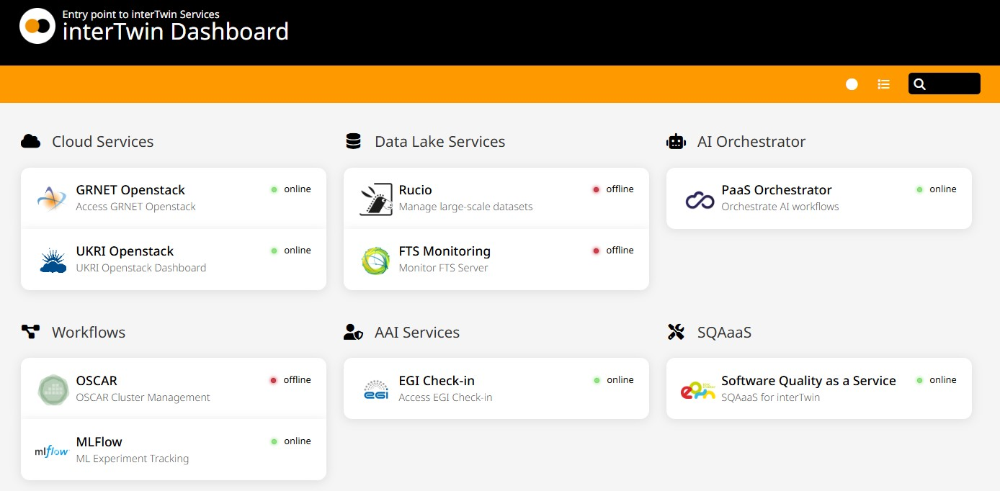

# interTwin Dashboard

## Overview

The **interTwin Dashboard** is a customizable entry point for interTwin services, providing a user-friendly interface to access and monitor cloud, data lake, AI orchestration, and other related services. Built with [Homer](https://github.com/bastienwirtz/homer), it includes a connectivity check feature to ensure the availability of resources.

This dashboard serves as a central hub for accessing tools and workflows, making it easier for users to navigate the interTwin ecosystem.



---

## Features

* **Customizable UI** : Modify themes, logos, and service details through configuration files.
* **Service Monitoring** : Real-time connectivity checks for integrated services.
* **Flexible Proxy Integration** : Utilizes [CORS Anywhere](https://github.com/Rob--W/cors-anywhere) to bypass CORS restrictions for external APIs.
* **Lightweight Deployment** : Runs in Docker containers for ease of setup and management.

---

## Prerequisites

Before setting up the dashboard, ensure you have the following installed:

1. [Docker](https://docs.docker.com/get-docker/)
2. [Docker Compose](https://docs.docker.com/compose/install/)

---

## Installation

### 1. Clone the Repository

```bash
git clone https://github.com/<your-username>/intertwin-dashboard.git
cd intertwin-dashboard
```

### 2. Configure the Environment

Aquí tienes un ejemplo detallado y profesional de un archivo `README.md` en inglés para tu repositorio:

---

# interTwin Dashboard

## Overview

The **interTwin Dashboard** is a customizable entry point for interTwin services, providing a user-friendly interface to access and monitor cloud, data lake, AI orchestration, and other related services. Built with [Homer](https://github.com/bastienwirtz/homer), it includes a connectivity check feature to ensure the availability of resources.

This dashboard serves as a central hub for accessing tools and workflows, making it easier for users to navigate the interTwin ecosystem.

---

## Features

* **Customizable UI** : Modify themes, logos, and service details through configuration files.
* **Service Monitoring** : Real-time connectivity checks for integrated services.
* **Flexible Proxy Integration** : Utilizes [CORS Anywhere](https://github.com/Rob--W/cors-anywhere) to bypass CORS restrictions for external APIs.
* **Lightweight Deployment** : Runs in Docker containers for ease of setup and management.

---

## Prerequisites

Before setting up the dashboard, ensure you have the following installed:

1. [Docker](https://docs.docker.com/get-docker/)
2. [Docker Compose](https://docs.docker.com/compose/install/)

---

## Installation

### 1. Clone the Repository

```bash
git clone https://github.com/<your-username>/intertwin-dashboard.git
cd intertwin-dashboard
```

### 2. Configure the Environment

1. Rename `example.env  ` to `.env` and adjust the values as needed:

   ```plaintext
   HOMER_PORT=8083
   CORS_PORT=8086
   ```

   * `HOMER_PORT`: The port where the dashboard will be accessible.
   * `CORS_PORT`: The port where **CORS Anywhere** will run.
2. Review the `config.yml` file in the root directory. This is the main configuration for the dashboard. Update the `<http://your-host-o-domain:port>` placeholders to point to the actual host and port of your **CORS Anywhere** instance.

### 3. Start the Services

Run the provided startup script to configure and launch the services:

```bash
./start-dockers.sh
```

During the startup process:

* The script will prompt you to specify the host and port for  **CORS Anywhere** .
* If no input is provided, it defaults to `http://localhost:8086`.

---

## Usage

1. Open your browser and navigate to the Homer dashboard:

   ```
   http://localhost:8083
   ```

   Replace `localhost` with the actual host if deployed remotely.
2. Explore the categories and services listed in the dashboard. Connectivity checks will indicate whether the services are available.

---

## Stopping the Services

To stop and clean up the services, use the provided `stop-dockers.sh` script:

```bash
./stop-dockers.sh
```

This script will:

* Stop all running containers.
* Remove unused Docker images and prune the system.

---

## Configuration

### Important Notes on Configuration Changes

1. **Default Configuration Location**:

   - The main configuration file for Homer is located at `./assets/config.yml` once the services are running.
2. **Automatic Design Updates**:

   - Any changes made directly to the `./assets/config.yml` file will be applied automatically to the dashboard without requiring a restart of the Docker containers. Simply refresh the browser to see the changes.
3. **Using the `./start-dockers.sh` Script**:

   - The `./start-dockers.sh` script generates the `./assets/config.yml` file from the `./config.yml` file in the root directory.
   - **Warning**: If you rerun the `./start-dockers.sh` script, any manual changes made directly to `./assets/config.yml` will be overwritten. To ensure your changes are preserved, update the `./config.yml` file in the root directory as well.

---

### Steps to Safely Modify Configuration

1. **Edit the Root `config.yml` File**:

   - Make your changes to the `config.yml` file located in the root directory.
   - This ensures your configuration is not lost when restarting or regenerating the dashboard.
2. **Edit Directly for Quick Changes** *(Optional)*:

   - For immediate updates, edit `./assets/config.yml`. These changes will apply without restarting the containers.
   - However, remember to copy these changes back to `./config.yml` in the root directory to make them permanent.

### Updating Services

To add or modify services, edit the `config.yml` file. Each service is defined under the `services` section. Example:

```yaml
services:
  - name: "Example Service"
    icon: "fas fa-tools"
    items:
      - name: "Example API"
        type: Ping
        logo: "assets/example.png"
        url: "https://example.com/"
        endpoint: "http://localhost:8086/https://example.com/"
        subtitle: "Example API endpoint"
        target: "_blank"
        method: "head"
        successCodes: [200, 301, 302]
        timeout: 5000---
```

---

## Contributing

We welcome contributions to improve the dashboard. To contribute:

1. Fork the repository.
2. Create a new branch (`feat/new-feature`).
3. Submit a pull request.

---

## License

This project is licensed under the [MIT License](https://chatgpt.com/c/LICENSE).

---

## Acknowledgments

* [Homer](https://github.com/bastienwirtz/homer) for the dashboard framework.
* [CORS Anywhere](https://github.com/Rob--W/cors-anywhere) for proxy suppor
